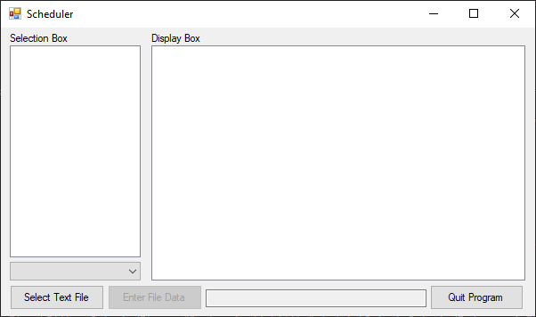
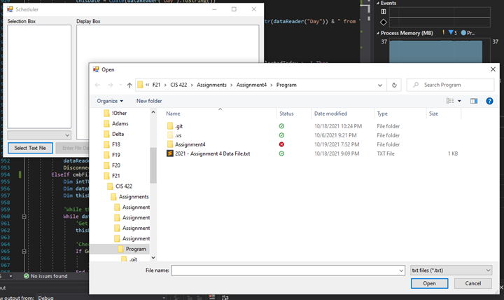
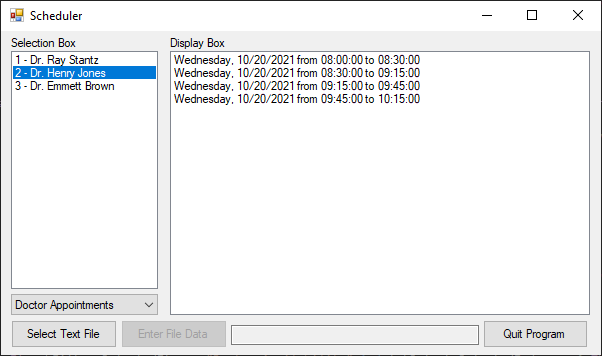
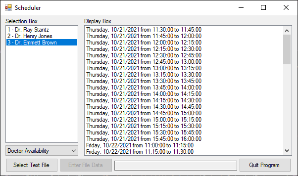
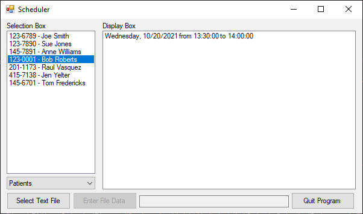
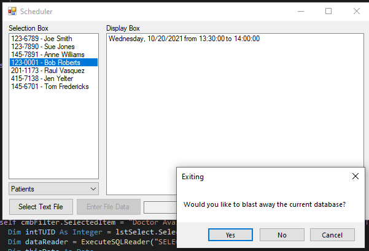

# Scheduling-App
Doctor and patient scheduling using VB.NET and SQL Server. Includes a GUI for easy access.

Main Screen

Open Browser Dialog locks user to only select .txt files

Doctors’ appointments (after running “2021 - Assignment 4 Data File.txt”)

Doctors’ availability (after running “2021 - Assignment 4 Data File.txt”) 

Patients’ appointments (after running “2021 - Assignment 4 Data File.txt”)

Exiting allows the user to choose to keep database or blast it

